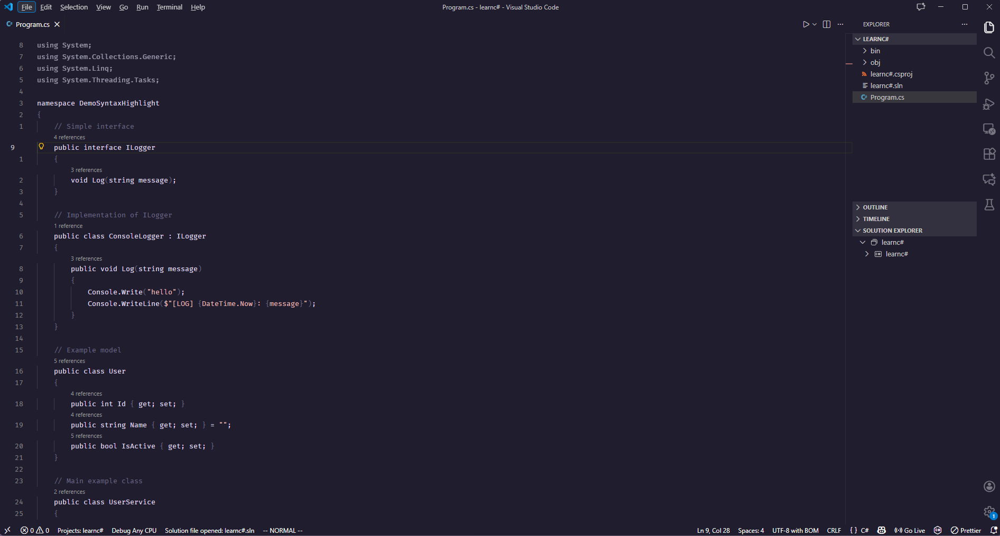
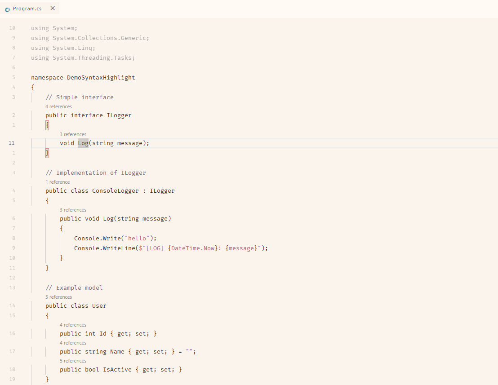

# Minimalis Final Boss Theme

"it's just text" ahh theme. this one uses a selection of colors from [Rose Pine](https://rosepinetheme.com/) colorscheme.

## Screenshots

### Dark Mode

### Light Mode

## Inspiration

This theme was inspired by a creator who explored Neovim without LSP. His minimal approach to colors motivated me to try designing a simple and clean colorscheme but for my VSCode.

## License

This project is licensed under the MIT License – see the LICENSE file for details.

## Changelog

See the full changelog in the [CHANGELOG.md](./CHANGELOG.md) file.
